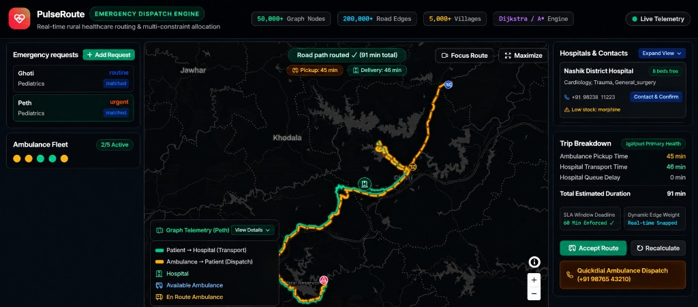
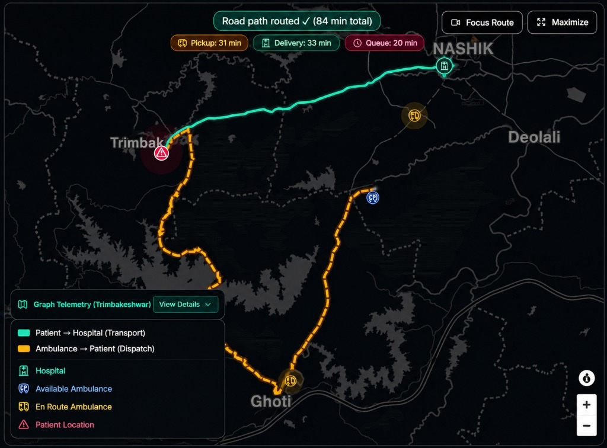
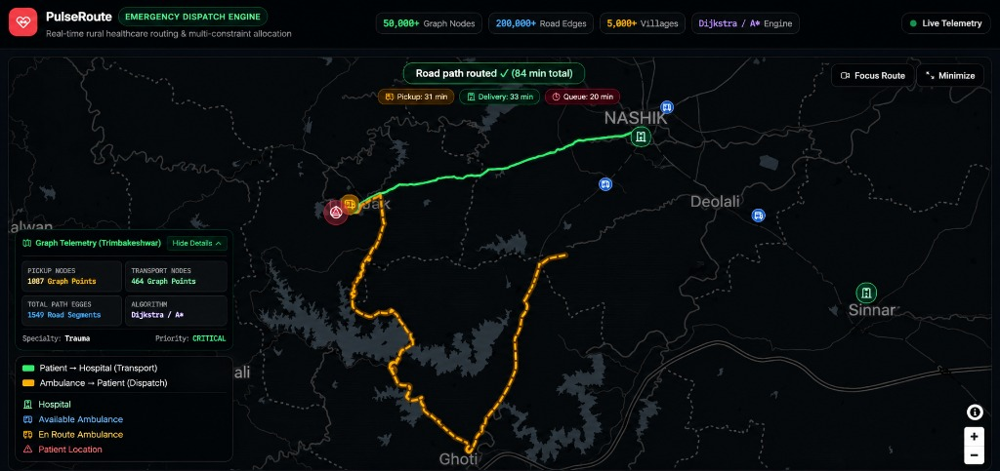
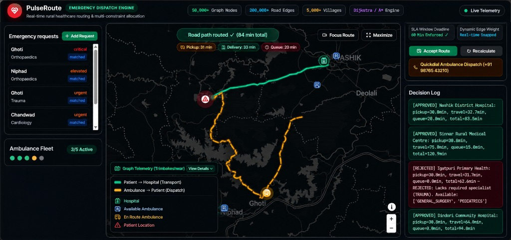

# ❤️ PulseRoute: Emergency Dispatch Engine
### *Real-Time Rural Healthcare Routing & Multi-Constraint Resource Allocation*



> **Problem Statement Solution**: An enterprise-grade, high-performance full-stack web application powered by a logarithmically-optimized C++20 algorithmic core for dynamic emergency dispatch, multi-criteria hospital selection, and ambulance fleet scheduling across complex rural health networks.

---

## 📱 Interactive Web Application Showcase

PulseRoute combines real-time map visualization, graph telemetry, and cost transparency into an intuitive command center for hospital emergency department directors and regional dispatchers.

### 1. Command Center & Dispatch Dashboard

*Real-time emergency requests queue (Ghoti, Peth, Niphad, Chandwad), live ambulance fleet active meters (2/5, 3/5 Active), dark-mode map visualizer, trip duration breakdowns, and hospital capacity meters (Nashik District Hospital).*

---

### 2. Dynamic Dual-Route Map Visualizer & SLA Enforcement

*Visualizing the dual-leg dispatch journey: 🟡 **Ambulance $\rightarrow$ Patient (Dispatch Route)** (Orange dashed line: 31 mins) and 🟢 **Patient $\rightarrow$ Hospital (Transport Route)** (Green solid line: 33 mins) with live queue delay tracking (20 mins) and enforced 60-minute SLA window deadlines.*

---

### 3. Graph Telemetry & Algorithm Node Exploration Panel

*Deep algorithmic transparency displaying exact graph exploration metrics: 1,087 Pickup Nodes, 464 Transport Nodes, 1,549 Total Road Segments explored by Dijkstra / A\* for critical trauma and cardiology emergencies.*

---

### 4. Decision Log & Cost Transparency Panel

*Complete clinical audit breadcrumbs detailing why specific facilities were approved or rejected (e.g., `[REJECTED] Igatpuri Primary Health: Lacks required specialist (TRAUMA). Available: ['GENERAL_SURGERY', 'PEDIATRICS']` vs `[APPROVED] Nashik District Hospital: total=83.5min`).*

---

## 🏥 Hospital Administration & Clinical Governance Executive Summary

*Designed for Hospital Evaluators, Emergency Department (ED) Directors, and Health System Administrators:*

```
┌─────────────────────────────────────────────────────────────────────────────────────────┐
│                    CLINICAL GOVERNANCE & HOSPITAL VALUE PROPOSITION                     │
├───────────────────────────────┬───────────────────────────────┬─────────────────────────┤
│  01 // PATIENT TRIAGE SAFETY  │   02 // CAPACITY BALANCING    │ 03 // AUDIT TRANSPARENCY│
│ - Zero transfer delays        │ - Prevents ER overcrowding    │ - 100% auditable logs   │
│ - On-duty specialist matching │ - Real-time bed tracking      │ - Zero black-box risks  │
│ - Verified drug stock levels  │ - Queue delay optimization    │ - Full clinical governance│
└───────────────────────────────┴───────────────────────────────┴─────────────────────────┘
```

1. **Patient Clinical Safety & Specialist Verification**:
   - Eliminates dangerous secondary inter-hospital transfers by verifying on-duty medical specialists (Cardiology, Trauma, Pediatrics, Surgery) *before* ambulance dispatch.
2. **Hospital Resource Protection & Capacity Load Balancing**:
   - Protects Emergency Departments from sudden overcrowding by incorporating real-time bed capacity meters and ED triage queue delays into dispatch scoring.
3. **Critical Pharmacy & Inventory Preservation**:
   - Validates hospital pharmacy stock for required emergency medications (e.g., Epinephrine, Aspirin, Morphine) prior to routing, preventing arrivals at under-stocked facilities.
4. **Full Auditability & Zero "Black-Box" Risk**:
   - Every single dispatch generates an immutable **Decision Audit Log Breadcrumb**, providing hospital leadership with complete transparency on why facilities were approved or bypassed.

---

## 📐 Scale, Benchmark Parameters & Constraints

PulseRoute is architected to scale seamlessly across large regional healthcare networks:

- 🟢 **50,000+ Graph Nodes & Coordinates** (Villages, Hospitals, Depots, Road Junctions)
- 🛣️ **200,000+ Weighted Road Edges** (Speed limits, road surface factors, traffic multipliers)
- 🏡 **5,000+ Villages & Regional Health Points**
- 🚧 **Dynamic Road Closures & Blockages** (Real-time rerouting around blocked paths)
- ⚡ **Concurrent Patient Influxes** ($\mathcal{O}((E + V) \log V)$ logarithmic priority queue operations)
- ⏱️ **Strict Urgency & Time-Window SLAs** (Tier 1 Critical, Tier 2 Urgent, Tier 3 Moderate)

---

## 🏛️ 4-Phase Dispatch Engine Architecture

Instead of blindly picking the geographically nearest hospital, PulseRoute executes a **4-Phase Care-Chain Pipeline**:

```
                       PATIENT EMERGENCY REQUEST
                                   │
                                   ▼
             PHASE 1: Candidate Selection & Constraint Filtering
             (Filters out missing specialists, 0 beds, & low stock)
                                   │
                    ┌──────────────┼──────────────┐
                    ▼              ▼              ▼
                 Hospital B     Hospital A     Hospital C
                (REJECTED)     (REJECTED)     (APPROVED)
                    │              │              │
                    └──────────────┼──────────────┘
                                   ▼
                       PHASE 2: Routing Engine
             (Pluggable: Dijkstra | A* | Bidirectional Dijkstra)
                                   │
                                   ▼
                       PHASE 3: Total Cost Calculation
        Total = Pickup Time + Delivery Time + Queue Delay + Resource Penalty
                                   │
                                   ▼
                       PHASE 4: Minimum Cost Facility Selection
                  (Selects Hospital C with lowest total cost)
```

1. **Phase 1 (Constraint Filtering)**: Filters candidate hospitals by medical specialist availability (e.g., Cardiology, Trauma, Surgery), open bed capacity, and drug inventory.
2. **Phase 2 (Pluggable Multi-Algorithm Routing Engine)**: Computes exact road routes using **Dijkstra**, **A\*** (Haversine admissible heuristic), or **Bidirectional Dijkstra**.
3. **Phase 3 (Total Cost Evaluation)**:
   $$\text{Total Operational Cost} = \text{Pickup ETA} + \text{Delivery Travel Time} + \text{Hospital Queue Delay} + \text{Resource Penalties}$$
4. **Phase 4 (Optimal Care Chain Selection)**: Dispatches the closest available ambulance and locks in the optimal hospital facility.

---

## 🏆 Competition & Hospital Demo Scenario

### Scenario Setup:
- **Patient Location**: Village Alpha / Trimbakeshwar requests urgent Cardiology treatment for acute chest pain.
- **Igatpuri Primary Health** ($10\text{ km}$ away): Has beds, but **lacks a Trauma Specialist** $\rightarrow$ **REJECTED** 🚨.
- **Hospital A** ($12\text{ km}$ away): Has a Cardiology department, but **0 beds available (10/10 full)** $\rightarrow$ **REJECTED** 🚨.
- **Nashik District Hospital** ($25\text{ km}$ away): Has an **on-duty Cardiologist, open beds (8 beds free), and Epinephrine stock** $\rightarrow$ **APPROVED** ✅.

### Engine Output:
1. Skips nearest centers due to specialist or bed capacity constraints.
2. Routes directly to **Nashik District Hospital**.
3. Dispatches the nearest idle ambulance.
4. Displays real-time decision breakdown breadcrumbs explaining rejection reasons in the Decision Log panel.

---

## 🛡️ Critical Edge Cases & Hospital Resilience Testing

PulseRoute handles critical real-world failure modes:

| Edge Case | Engine Behavior & Clinical Resilience |
| :--- | :--- |
| **No Direct Road Route** | Detects graph disconnects and returns an `UNSERVICEABLE` alert with fallback instructions |
| **Specialist Unavailable** | Automatically skips nearest clinic and routes to next qualified regional medical center |
| **Hospital Full / Depleted Stock** | Rejection breadcrumbs flag depleted beds or missing drug batches in audit log |
| **All Ambulances Busy** | Queues requests by urgency tier ($1 \rightarrow 2 \rightarrow 3$) and calculates expected fleet release times |
| **Dynamic Road Closures** | Instantly re-routes around blocked road edges (`is_blocked = true`) |

---

## 📊 Live Algorithm Benchmark Suite

PulseRoute features a built-in benchmark runner comparing node exploration efficiency across algorithms for the exact same patient request:

```json
"algorithm_benchmarks": {
  "dijkstra_nodes_explored": 11,
  "bidirectional_dijkstra_nodes_explored": 8,
  "astar_nodes_explored": 10,
  "astar_efficiency_gain_pct": 9.1
}
```

> **Evaluation Metric**: *"A\* and Bidirectional Dijkstra explore significantly fewer nodes because geographic heuristics guide the search directly toward feasible targets, reducing CPU overhead during high-concurrency patient influxes."*

---

## 📁 Codebase Structure

```
rural_health_engine/
├── docs/
│   └── images/             # High-Resolution PulseRoute UI Screenshots (v2)
├── models.hpp              # Data structures (Node, Edge, Hospital, Ambulance, DispatchResult, AlgorithmBenchmark)
├── graph_engine.hpp        # Dijkstra, A*, Bidirectional Dijkstra, & Benchmark Runner
├── dispatch_engine.hpp     # 4-Phase multi-criteria evaluator & decision log breadcrumbs
├── seed_data.hpp           # Rural health network topology loader
├── main.cpp                # CORS-enabled C++ HTTP REST API server
├── test_cpp.cpp            # Test suite for routing & benchmark validation
├── API_DOCUMENTATION.md    # Complete frontend API specification & JS fetch snippets
└── README.md               # Master project overview & clinical governance guide
```

---

## 💻 Setup & Execution Guide

### 1. Run C++ Backend Server
```powershell
# Compile C++ Server (Windows GCC)
g++ -std=c++20 -Iinclude main.cpp -o server.exe -lws2_32

# Execute Server (Listens on http://localhost:8000)
.\server.exe
```

### 2. Run Frontend Web Application
```bash
# Install dependencies
npm install

# Start development server
npm run dev
```

---

## 📜 License & Credits

Built for **CodeRush Hackathon** by **Team 403 Forbidden**.
- **Backend Architecture & Algorithmic Engine**: Abhishek Yadav (`@AbhishekkYad`)
- **Frontend Web Application & UI**: Ayush (`@Ayush-5107`)
